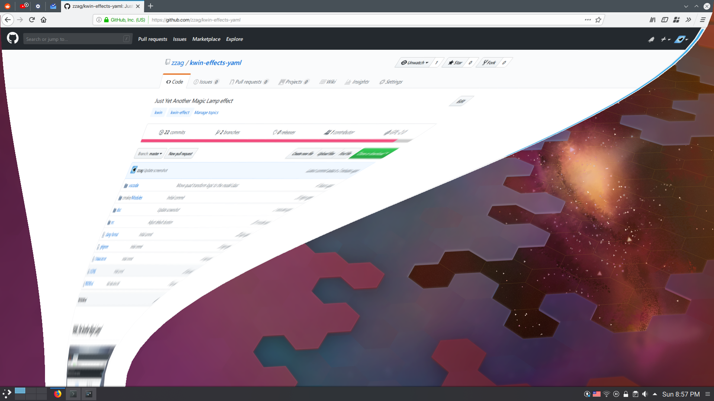

# Yet Another Magic Lamp



[Demo](https://www.youtube.com/watch?v=BR4bUwFZDS8)

Yet Another Magic Lamp is a window minimization effect for KWin. Whenever a window
is minimized, it'll get sucked down into the dock/panel. The main difference
between this effect and the one shipped with KWin is that this effect is more
"curvy". In addition to that, this effect works correctly with weird setups
(e.g. the panel is between screens) and has more configuration options.

This is mostly eye-candy stuff. If you want to be more productive, consider
using another window minimize animation (e.g. [Scale](https://store.kde.org/p/1267839/), etc).

### Installation

#### Binary package

On openSUSE Tumbleweed

```sh
sudo zypper ar obs://home:trmdi trmdi
sudo zypper in -r trmdi kwin-effects-yaml
```

#### Build from source

You will need the following dependencies to build this effect:
* CMake
* any C++14 enabled compiler
* Qt
* libkwineffects
* KDE Frameworks 5:
    - Config
    - CoreAddons
    - Extra CMake Modules
    - WindowSystem

On Arch Linux

```sh
sudo pacman -S cmake extra-cmake-modules kwin
```

On Fedora

```sh
sudo dnf install cmake extra-cmake-modules kf5-kconfig-devel \
    kf5-kcoreaddons-devel kf5-kwindowsystem-devel kwin-devel \
    qt5-qtbase-devel
```

On Ubuntu

```sh
sudo apt install cmake extra-cmake-modules kwin-dev \
    libkf5config-dev libkf5configwidgets-dev libkf5coreaddons-dev \
    libkf5windowsystem-dev qtbase5-dev
```

After you installed all the required dependencies, you can build
the effect:

```sh
git clone https://github.com/zzag/kwin-effects-yet-another-magic-lamp.git
cd kwin-effects-yet-another-magic-lamp
mkdir build && cd build
cmake .. \
    -DCMAKE_BUILD_TYPE=Release \
    -DCMAKE_INSTALL_PREFIX=/usr
make
sudo make install
```

### Using the effect

Go to System Settings > Desktop Behavior > Desktop Effects, and select
"Yet Another Magic Lamp", then click Apply.

### Contributing

Any help is welcome. If you have suggestions how to improve this effect(e.g.
different duration for each stage of the animation, etc), please create a new
issue. If you'd like to contribute by implementing some feature, make sure
you've run clang-format before creating a PR.
